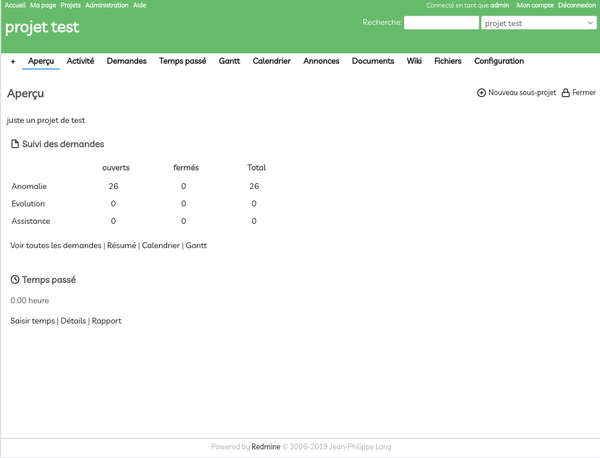
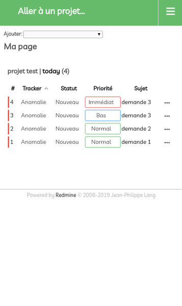

# RedmineThemeMaterrial

RTMaterial is a theme for redmine.





The theme use two colors: *Primary* and *Accent*.

You can change the default theme: you can copy theme in stylesheet\colors in stylesheet\ and rename theme color.css.

You can change the default icon: you can copy icon in stylesheet\ico in favicon\ and rename theme favicon.ico.


Sample

```
cp stylesheet\colors\color-blue-red.css stylesheet\
mv stylesheet\colors.css stylesheet\color.css.default
mv stylesheet\color-blue-red.css stylesheet\color.css 
mv stylesheet\ico\icon-blue.ico favicon\favicon.ico 
```

You can add a specific color theme by project: You must use https://github.com/fraoustin/redmine_rtmaterial plugin.

List of color:

- red
- pink
- purple
- deepPurple
- indigo
- blue
- lightBlue
- cyan
- teal
- green
- lightGreen
- lime
- yellow
- amber
- orange
- deepOrange
- brown
- grey
- blueGrey


You can load a specific theme  

You can use palette of color from https://material-ui.com/customization/color/

Icons from https://feathericons.com/

## Install with local redmine

::

    cd /usr/src/redmine/public/themes
    git clone https://github.com/fraoustin/RTMaterial.git

## Use Docker

::

    cd $home
    git clone https://github.com/fraoustin/RTMaterial.git
    docker run -d -p 3000:3000 -v $home/RTMaterial:/usr/src/redmine/public/themes/RTMaterial --name redmine redmine